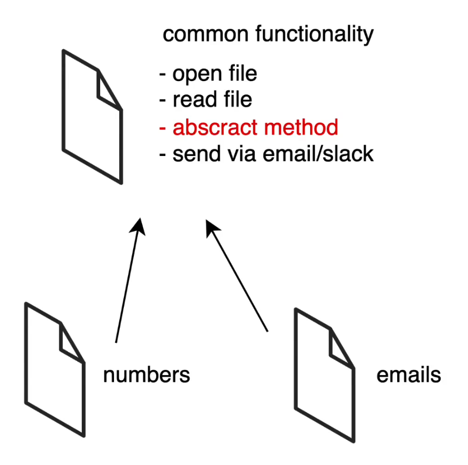

# ExtractorReport

By making this class abstract we can define these methods:

`public abstract Pattern getPattern();`

`public abstract String getReportName();`

By doing so, the method `public String parse(String path)`
can now receive the _pattern_ and the _reportName_ to personalise the output.

Now, we only have to create _Email, Phone, Names,_ etc classes, make them extends
from the _ExtractorReport_ and override the methods.

